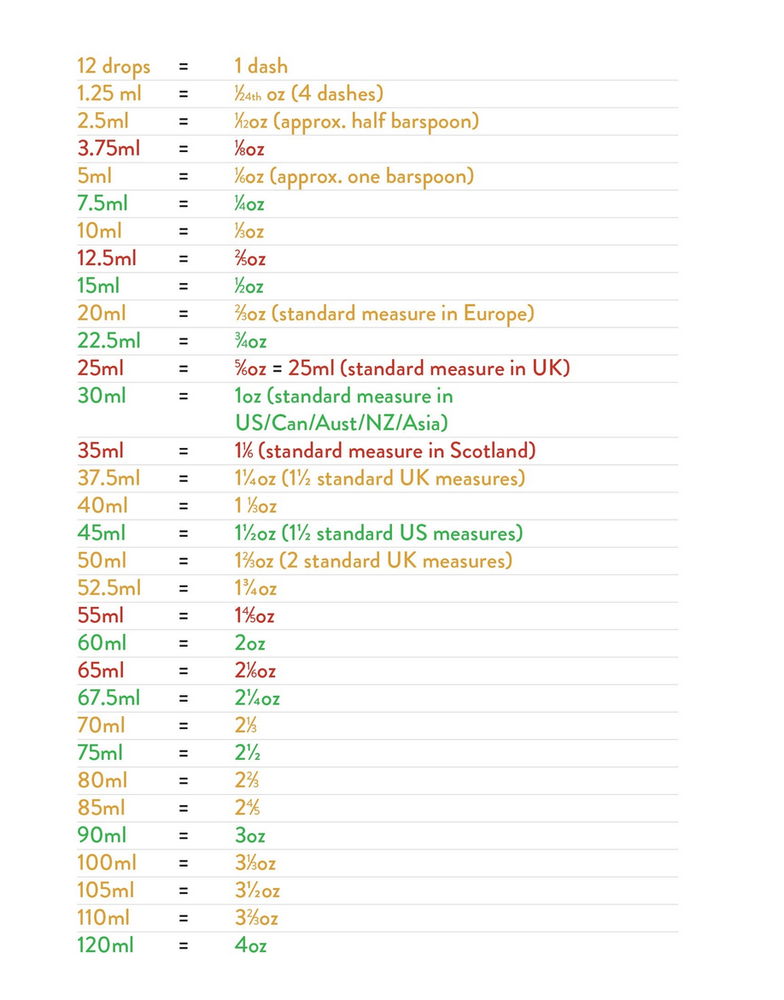

# Drinks README

## Inventory

| Booze           | Fruits | Mixers          |
|-----------------|--------|-----------------|
| Bulliet Bourbon | Limes  | Club Soda       |
|                 | Lemons | Pineapple Juice |
|                 | Mint   | Tonic Water     |

### Booze
- [ ] Bulliet Whiskey

### Fruits
- [ ] Limes
- [ ] Lemons
- [ ] Mint
- [ ] Orange
- [ ] Cherries

### Mixers
- [ ] Club Soda
- [ ] Pineapple Juice
- [ ] Tonic Water
- [ ] Orange Juice
- [ ] 7 Up

## Reference 

### Sources

- [Open Source Drinks](https://github.com/alfg/opendrinks)
- [VesperApp (make drinks from what you have)](https://drinkrecipes.herokuapp.com/) 
- [LaTex - Control column width](https://texblog.org/2019/06/03/control-the-width-of-table-columns-tabular-in-latex/)

### Sizes in Text

|  Size  |  Text  |
|:------:|:------:|
| 3/4    | ¾      |
| 2/3    | ⅔      |
| 1/2    | ½      |
| 1/3    | ⅓      |
| 1/4    | ¼      |

[Source](https://en.wikipedia.org/wiki/Number_Forms)

### Conversions

