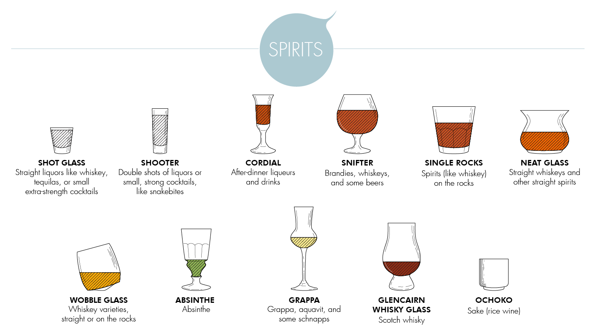
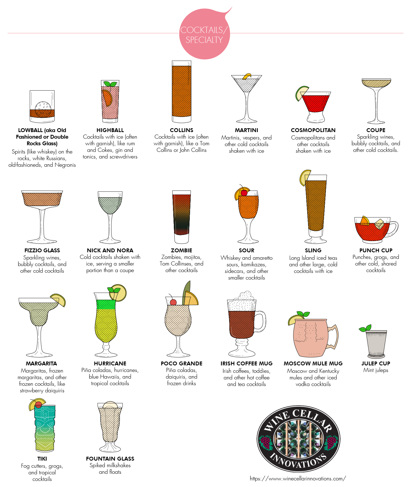
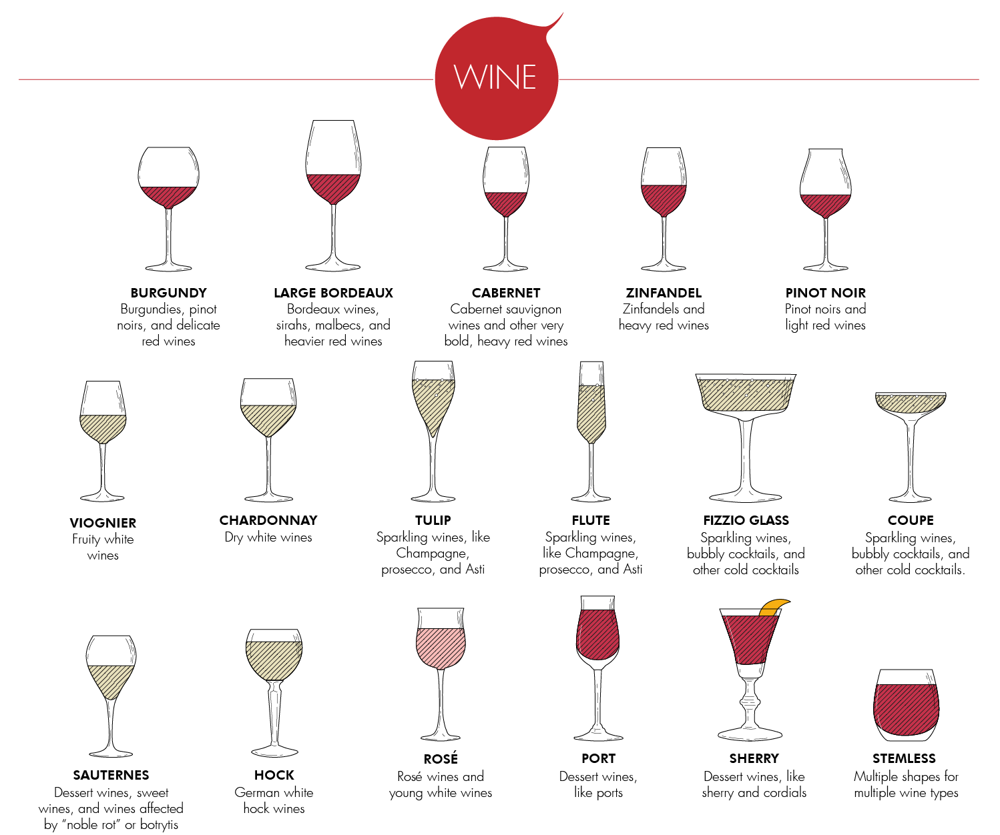
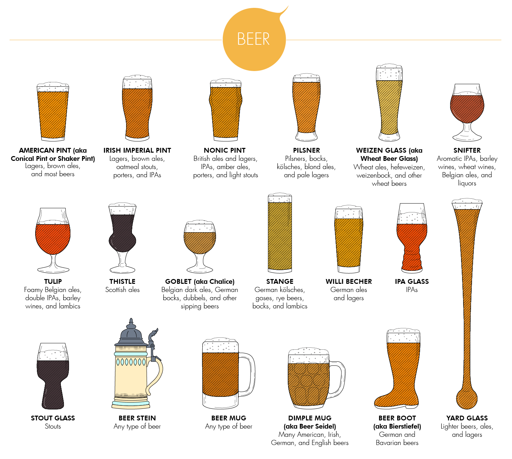

# Drink Glasses

<!-- START doctoc generated TOC please keep comment here to allow auto update -->
<!-- DON'T EDIT THIS SECTION, INSTEAD RE-RUN doctoc TO UPDATE -->
**Table of Contents**

- [Spirit Glasses](#spirit-glasses)
- [Cocktail Glasses](#cocktail-glasses)
- [Wine Glasses](#wine-glasses)
  - [Red Wine Glasses](#red-wine-glasses)
  - [White Wine Glasses](#white-wine-glasses)
  - [Pink Wine Glasses](#pink-wine-glasses)
  - [Dessert Wine Glasses](#dessert-wine-glasses)
- [Beer Glasses](#beer-glasses)
  - [Beer Pint Glasses](#beer-pint-glasses)
  - [Craft Beer Glasses](#craft-beer-glasses)

<!-- END doctoc generated TOC please keep comment here to allow auto update -->

[Source](https://www.winecellarinnovations.com/drinking-glasses)

## Spirit Glasses

- __Shot Glass__ - It’s found in most bars across the U.S. and holds one-and-a-half fluid ounces.
- __Shooter__ - Perfect for layered shots like the B-52, brain hemorrhage, kamikaze, and lemon drop, the shooter is typically about a double portion of a shot glass.
- __Cordial__ - Ideal for after-dinner liqueurs and small cocktails, a cordial is a stemmed glass that’s usually between one and one and a half ounces.
- __Snifter__ - The snifter, balloon, or brandy bowl is a wide-rimmed, stout glass that’s among the best drinking glasses for brandies, cognacs, and after-dinner drinks. It’s also become popular for drinking IPAs. If you’re trying to reduce the number of types of glasses in your cabinet, having a few of these glasses on hand is probably a good idea.
- __Single Rocks__ - Often, bartenders will pour out a single on the rocks in an old-fashioned glass, but technically, the old-fashioned is for a double portion, and some bars have separate glasses for singles.
- __NEAT Glass__ - A recently designed invention, this strangely shaped glass is meant to choke out the “nose-numbing ethanol” and reveal the more complex aromas of plain spirits like whiskey and bourbons.
- __Wobble Glass__ - A fun and fashionable new style of unique drinking glasses, the wobbling glasses are “un-spillable” and feature a convex bottom that rolls the alcohol around inside.
- __Absinthe Glass__ - A once-obscure drink that resurfaced in popularity after re-legalization, absinthe has its own glass and typically comes with a slotted spoon, among other accouterments.
- __Grappa Glass__ - For wines made from leftover skins, pulps, and seeds, this glass is meant to trap the beverage and create a long “aroma chimney.”
- __Glencairn Whisky Glass__ - A relatively new invention, this Scottish-made glass developed by Glencairn Crystal Ltd. is specifically designed for sipping Scotch whiskey.
- __Ochoko__ - Sake is traditionally poured out of a flask called a tokkuri into small cups, which are either ochoko (the common type of cups Westerners see), sakazuki (which are like saucers), or masu (which are wooden boxes).

## Cocktail Glasses 

- __Lowball Glass__ - Among the most universal cocktail glass types, the lowball or old-fashioned glass is perfect for muddled drinks. Often, people just use them for drinking spirits on the rocks.
- __Highball Glass__ - Taller than the lowball, this is another one of of the more common types of drinking glasses that bartenders reach for.
- __Collins Glass__ - A 12-to-14-ounce glass that’s taller and slimmer than a highball, the Collins glass, once used primarily for the Tom Collins, can be used for a large number of cocktails. It looks very good sporting some manner of long garnish.
- __Martini__ - A classic piece of cocktail glassware, there’s nothing quite like the unique shape of the martini glass, which was popularized by James Bond and is now used for many types of cold, [shaken drinks](https://www.townandcountrymag.com/leisure/drinks/g9158516/fun-martini-recipes-vodka-gin/).
- __Cosmopolitan__ - This drink, a frequent star of Sex and the City and integral to the Manhattan identity, can certainly go in a martini glass but really belongs in the short, squat version.
- __Coupe__ - In recent years, the martini glass has been replaced by the more retro-chic coupe, a leftover from the Prohibition era. It’s the perfect vessel for many kinds of cold, shaken cocktails as well as bubbly wines. It’s far less tippy, more aesthetically pleasing, and fantastically versatile.
- __Fizzio__ - The obscure, Prohibition-era “fizzio coupe” is a flat-bottomed glass typically used with bubbly wines and cocktails. It’s perfect for those hoping to emulate the look and feel of The Great Gatsby.
- __Nick and Nora__ - This is another Prohibition-era glass that’s skyrocketed in popularity in recent years. Like the coupe, it’s usually used for brandies, cocktails, and bubbly drinks. It only holds about five ounces, though.
- __Zombie__ - This classic glass once exclusively for the traditional zombie drink recipe is today a popular container for dozens of popular cocktails.
- __Sour__ - Almost like a short champagne flute, the sour glass is ideal for whiskey sours and amaretto sours.
- __Sling__ - This tall glass meant to hold ice and reduce condensation is great for a Long Island iced tea.
- __Punch Cup__ - Punch has a long history, dating back to Dickensian times. One doesn’t often find it at bars, but it still sometimes appears at holiday parties.
- __Margarita__ - With a wide rim often covered in salt, this strangely shaped glass is a favorite for the famous margarita, both frozen and fresh.
- __Hurricane Glass__ - This is a favorite for hurricane cocktails, which feature rum and several types of juice.
- __Irish Coffee Mug__ - Hot cocktails like the classic hot toddy and Irish coffee are usually put into this mug, which has a handle so you don’t burn your fingers.
- __Moscow Mule Mug__ - In recent years, the Moscow mule and Kentucky mule have exploded in popularity. The copper of these cups is supposed to enhance the unique flavors of the drinks.
- __Julep Cup__ - The mint julep has a [long and proud history](https://www.theatlantic.com/national/archive/2014/05/the-history-of-the-mint-julep/361659/) and is typically downed from a pewter or sterling silver cup.
- __Tiki Glass__ - After World War II, Polynesian-style drinks spiked in popularity, and they’ve experienced a recent renaissance.
- __Fountain Glass__ - This glass is perfect for a variety of boozy ice cream floats.

## Wine Glasses

### Red Wine Glasses

The big difference between red and white wine glasses is that red wine glasses are typically larger and fatter, allowing for more air to come into contact with the wine. This helps the wine oxidize and releases new aromas and keep the wine the desired temperature.

- __Burgundy__ - This big wine glass has a wide bowl for taking in more complex aromas in delicate red wines and a thin lip for bringing the wine more toward the tip of the tongue. It’s a great choice for Burgundies, pinot noirs, and any delicate red wines.
- __Large Bordeaux__ - This taller, thinner glass splashes the wine to the back of the mouth, and it’s intended for full-bodied, heavy red wines like sirahs and malbecs.
- __Cabernet__ - This tall wine glass directs the wine to the center of the tongue, which helps to moderate the acidity of heavy wines like cabernet sauvignon.
- __Zinfandel__ - Spicy, peppery wines do well in this container, which is shaped closer to the “standard” red wine glass and features a wide, thin rim.
- __Pinot Noir__ - A wine glass that tapers at at the top, this is to make sure that the wine comes into contact with more air, which is perfect for lighter, less “meaty” red wines.

### White Wine Glasses

Red wines are served at room temperature, and white wines are served chilled. This means there are fairly significant differences in the design of red vs. white wine glasses, as white wine needs to come into contact with some, but not too much, room-temperature air. The different wine glasses for white wines are typically made of thicker glass than their red counterparts, in part to help ensure that the temperature stays cold.

- __Chardonnay__ - Spicier, nuttier white wines need more surface area to bloom. The straighter glass sends the wine to the sides of the tongue.
- __Viognier__ - The viognier is considered somewhat of a standard for white wine glasses, with the U-shape enhancing pretty much everything light and fruity and keeping the beverage cold.
- __Tulip__ - The flute and tulip are special glasses meant for sparkling wines. The tulip is generally preferred for wines that have been fermented in the bottle, as, again, more surface area gives more room for oxygen and exciting aromas.
- __Flute__ - The instantly recognizable flute is perfect for bubbling wines like Astis, Champagne, and more.
- __Vintage__ - For those who prefer a bit more of a retro-style look while they’re drinking sparkling wine, the vintage, or coupe, has made a comeback. The coupe is very versatile, as it’s also often used for chic cocktails. (See the cocktail section.)
- __Hock__ - At one time, these small crystal wine cups were hugely popular and preferred for sweet German white wines.
 
### Pink Wine Glasses

- __Rose__ - Rosé should be served cold, and as such, this glass has a long stem to prevent warming. It also has a flared lip for directing the tart wine to the tip of the tongue, enhancing sweetness and minimizing any acidic aftertaste.

### Dessert Wine Glasses

- __Sauternes__ - This shape is designed for barrel-aged sweet wines in a way that brings complex acidities to the forefront. It’s perfect for dessert wines like ausbruch, Sauternes, and Monbazillac.
- __Port__ - With a smaller portion and a nice, sloped lip that brings the sweet flavors to the front of the tongue, this is the perfect glass for fans of dessert wine.
- __Sherry__ - Small portions of cold sherry can be poured into these simple glasses.

## Beer Glasses

As there are many different kinds of beer, there are many different types of glasses for beer. With glasses shaped for specifically stouts, IPAs, lagers, and pilsners, beer glasses can sometimes be just as confusing as wine glasses! We’ve clarified some of these differences in our guide.

### Beer Pint Glasses

The following glasses can be used for many different types of beers, ales, and lagers:

- __American Pint__ - The classic 16-ounce “conical” glass is appropriate for most American styles of beers and can be found at most craft breweries around the U.S.
- __Irish Imperial Pint__ - Popular overseas, this smooth beer glass tapers out to maximize a foamy head.
- __Nonic Pint__ - The little dimple toward the top brings this pint to a full 20 ounces.
- __Beer Mug__ - A traditional beer mug comes in many shapes and sizes but is typically found to be about a pint in size.
- __Beer Stein__ - While they’re not technically glassware and they’ve fallen a bit out of fashion, German beer steins are decorative, beautiful, and fun.
- __Dimple Mug__ - Dimple mugs are designed so that one can see quickly how much beer they’ve drunk or poured in one evening.
 
### Craft Beer Glasses

These beer glasses are designed to enhance the taste of specific types of beer:

- __Pilsner Glass__ - The tall, sleek pilsner glass is meant for blond ales, pale lagers, bocks, and, naturally, pilsners.
- __Weizen Glass__ - The slight curvature gives more room for the head and aroma of wheat beers.
- __Snifter__ - Traditionally a glass meant for brandy (see the cocktail section), this glass has also become popular for sampling more aromatic IPAs and wheat wines.
- __Tulip__ - As with the snifter, hoppy, malty, and aromatic beers do well in this big glass, but the flared edge brings ale to the tip of the tongue. It’s often specifically used for Belgian ales.
- __Thistle__ - For heavy Scotch ales, this glass is meant to resemble the national flower of Scotland.
- __Goblet__ - Heavier, malty beers with complex aromas would do well in these wide, decorative bowls.
- __Stange__ - Light, delicate beers like lambics and bocks do well in this Champagne flute of beer glasses.
- __Willi Becher__ - While it’s lesser-known in the states, this glass is a favorite in Germany for German beers.
- __IPA Glass__ - A fairly recent invention, the IPA glass, co-developed by breweries Dogfish Head and Sierra Nevada, is meant to harness aromas and has ridges to help aerate the IPA from the inside.
- __Stout Glass__ - Like the IPA glass, the stout glass is a recent invention, this one meant to capture a huge head and show off the malty aromas of a good stout.
- __Beer Boot__ - “Das Boot” has a funny history and is essential for Oktoberfest fans.
- __Yard Glass__ - Size doesn’t matter, right? Well, beer fans might disagree when they reach for a full yard of ale.
